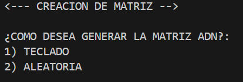
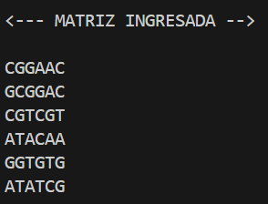
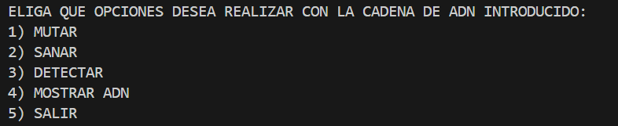
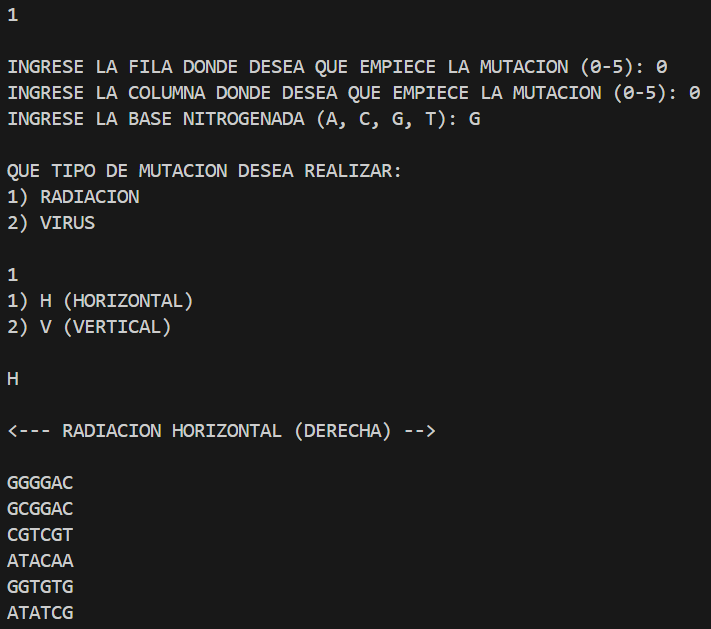
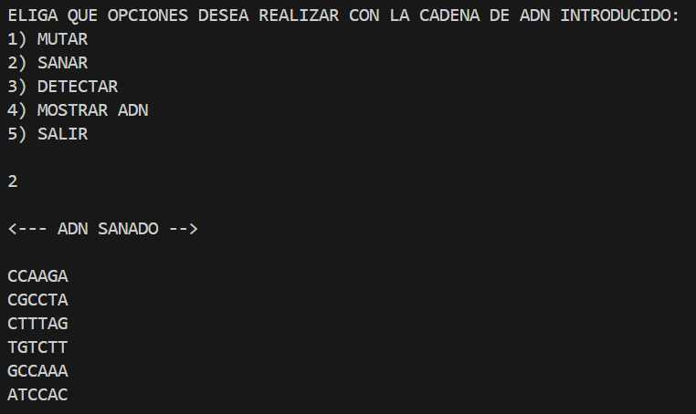
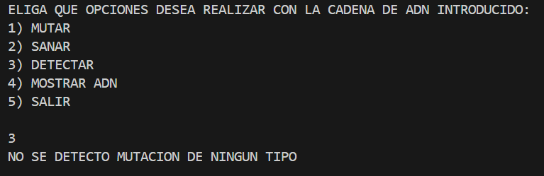
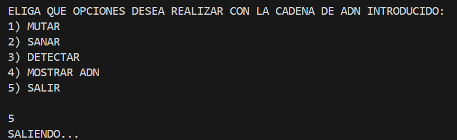

# Proyecto global ADN Mutante

Esto permite crear una matriz de ADN para realizar diversas operaciones, como detectar mutantes, aplicar mutaciones (por radiación o virus) y sanar mutantes. La matriz ADN puede ser generada aleatoriamente o ingresada manualmente, y las bases nitrogenadas permitidas son `A`, `C`, `G` y `T`.

## Participantes del Grupo
- **Integrante 1:** Alex Rodriguez
- **Integrante 2:** Ignacio Bevilacqua
- **Integrante 3:** Manuel Rivas 

## Estructura del proyecto

│
├── ejecutable.py           #Archivo principal con la función main
├── clases.py               # Contiene todas las clases del programa
├── README.md               # Documentación del proyecto
└── img/                    # Carpeta que contiene las imágenes utilizadas  README.md

## Ejemplo de uso

### Creacion de la matriz ADN
- La matriz ADN puede ser generada aleatoriamente o por teclado
- Si se ingresa por teclado debe estar compuesta por 6 líneas, cada una con 6 caracteres.
- Solo puede contener los caracteres: `A`, `C`, `G` y `T`.
- Si se introduce un formato incorrecto, el programa mostrará error.

### Menu principal

- Mutamos el ADN horizontalmente en la posicion (0,0) con la base nitrogenada `G`

### Ejemplo de mutacion horizontal

- Luego sanamos la mutacion horizontal que acabamos de crear

### Ejemplo de adn sanado

- Verificamos que no contenga mutaciones luego de sanar

### Verificacion de mutaciones

-Por ultimo finalizamos el programa introduciendo el número 5

### Finalizando ejecucion del programa

